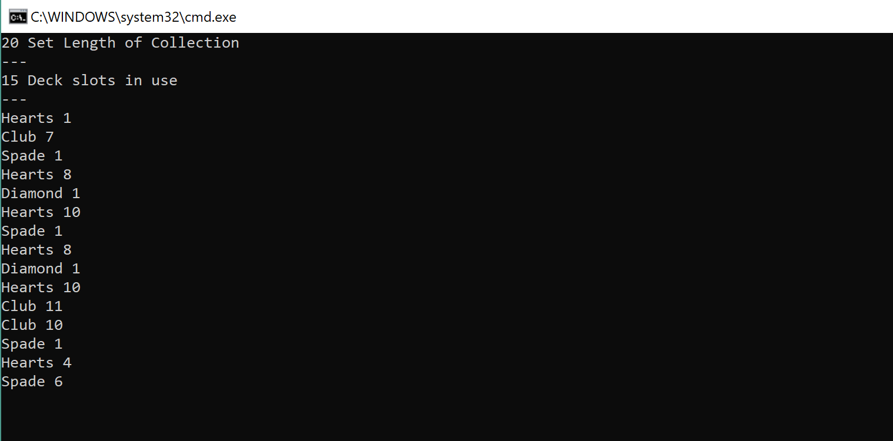

# Lab-07-Collections

This is a practice in defining custom collections within the C# Language. The custom collection is defined as Deck< Card> which will hold a Card object. Each Card object has a integer value and an Enum Card Suite.

This collection has the ability to Add a card, Remove a card, get length of the available cards and shuffle the cards around.

Unit tests are including with the project.
***
## Getting Started
* Download the Lab07-Collections project
* After it's been downloaded, navigate to the .csproject file and open up Visual Studio. It is built using the latest .NET 2.1 SDK
* Once the project is opened, run it with or without debug and a console should appear. If the below image is what you are greeted with then success! You can see a the collection and methods demonstrated in the console window by pressing enter
***
## What it should look like

***
